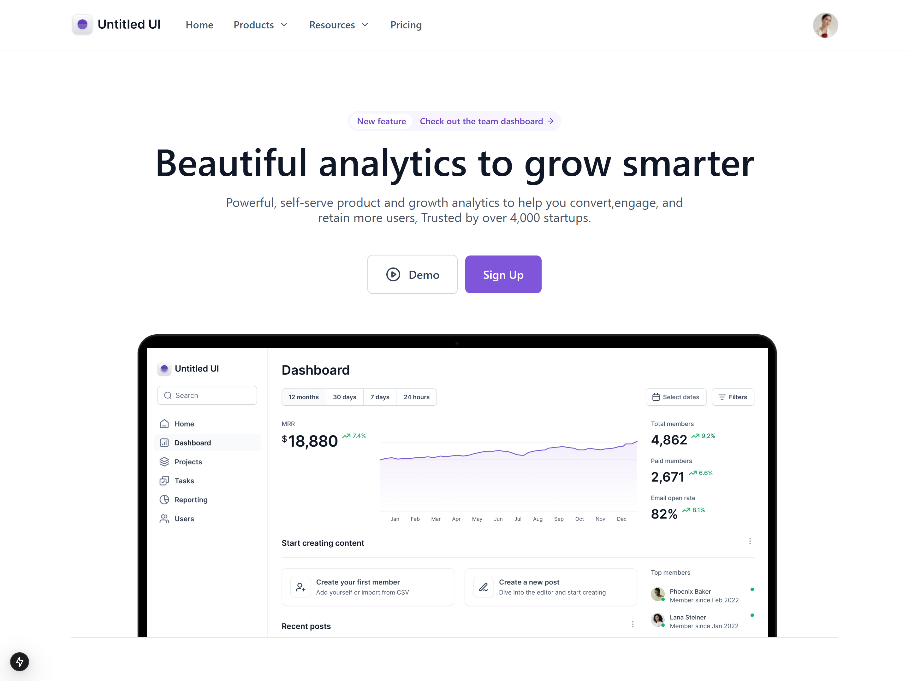

## Untitled UI

This project utilizes the Untitled UI Free Figma UI Kit (v2.0) to create a modern and responsive landing page with a clean and professional aesthetic. By leveraging this design system, it ensures consistency, ease of customization, and efficient prototyping, making it ideal for both personal and commercial use.

[Figma project](https://www.youtube.com/redirect?event=video_description&redir_token=QUFFLUhqbmhhVjM2YWxueUtGYlNwUW11aThtRDhBazFyZ3xBQ3Jtc0tuc0pmczZBeFI1LWxpcGk5cVAyQm5oNTF5SXlkX3VMejJEc3NhcktBcEZQaGFSQzhVUHdzY2xxSVJ2ZkQxejlFbG5xZnN4d3M3Z1FJLTBQSDgyVXJQZmVrWk1BcTNMS3hJNFk4UlE5VTk5U3Q0bkZvSQ&q=https%3A%2F%2Fwww.figma.com%2Fcommunity%2Ffile%2F1020079203222518115%2Funtitled-ui-free-figma-ui-kit-and-design-system-v2-0%3FsearchSessionId%3Dlyp1xuha-jqtfbgs8aog&v=uwLdIIOtvu4)

